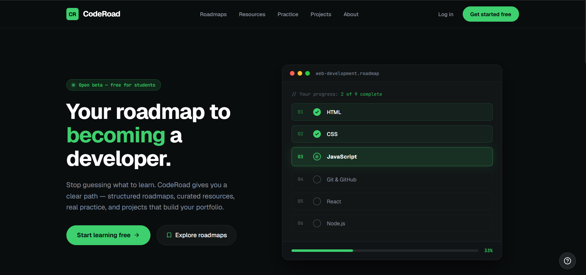

# Personal Portfolio Website — Abhishek Hallur

<p align="center">
  
</p>

<p align="center">
  <a href="https://abhishek-hallur.github.io/Abhishek_Hallur/"></a>
  <a href="LICENSE"></a>
  
  
</p>

---

## 🌟 Overview

Welcome to my personal developer portfolio! This project is crafted to showcase my skills, projects, and passion as a Frontend Developer. Built entirely with **semantic HTML5**, **vanilla CSS3**, and **clean modern JavaScript**, the site delivers a high-performance, visually immersive user experience with ambient audio, interactive star constellations, and responsive layouts across all devices.

🔗 **Live Deployment:** [https://abhishek-hallur.github.io/Abhishek_Hallur/](https://abhishek-hallur.github.io/Abhishek_Hallur/)

---

## ✨ Features

- 🌌 **Dual Time-Lapse Backgrounds:** Smooth crossfade transition between dynamic Milky Way night stars and daylight sky videos.
- ✨ **Interactive Constellation Canvas:** Starfield particle animation with magnetic mouse breeze physics and dynamic constellation linking.
- 🎵 **Floating Ambient Audio Player:** Integrated background soundtrack (*Meridian Drift*) with real-time animated equalizer bars.
- 💼 **Featured Projects Showcase:** Responsive project cards with 16:9 thumbnails, glassmorphism tags, hover zoom micro-animations, and direct live demo previews.
- 📱 **Fully Responsive Across All Devices:** Optimized specifically for small phones (320px–420px), standard smartphones, tablets (iPad/Surface), and ultra-wide desktops.
- 🌓 **Day / Night Theme Toggle:** Smooth light and dark mode switching with persistent local state.
- 🎯 **3D Parallax & Magnetic Cursor:** Interactive perspective tilt effects on cards and magnetic nav links.
- 📬 **Interactive AJAX Contact Form:** Seamless contact form integration with loading states and real-time response feedback.

---

## 🛠️ Tech Stack

- **Markup:** [HTML5](https://developer.mozilla.org/en-US/docs/Web/HTML) (Semantic, Accessible, SEO-friendly)
- **Styling:** [CSS3](https://developer.mozilla.org/en-US/docs/Web/CSS) (Vanilla CSS, Glassmorphism, CSS Grid, Flexbox, Custom Properties)
- **Scripting:** [JavaScript (ES6+)](https://developer.mozilla.org/en-US/docs/Web/JavaScript) (HTML5 Canvas API, IntersectionObserver, Audio API)
- **Icons & Typography:** [Font Awesome 6](https://fontawesome.com/) & [Outfit / Google Fonts](https://fonts.google.com/)

---

## 📁 Project Structure

```text
├── assets/                  # Media assets (audio, videos, images, and vector icons)
│   ├── coderoad-thumbnail.png # CodeRoad project preview thumbnail
│   ├── css-icon.svg         # CSS3 vector icon
│   ├── Meridian_Drift.mp3   # Ambient background audio track
│   ├── milky way.mp4        # Night stars time-lapse video
│   ├── sky.mp4              # Daylight time-lapse video
│   └── vscode.png           # VS Code tool icon
├── index.html               # Main website markup & structure
├── style.css                # Core design system, glassmorphism tokens & responsive media queries
├── script.js                # Particle physics, audio player, theme toggle, and micro-interactions
├── LICENSE                  # MIT Open Source License
└── README.md                # Project documentation & overview
```

---

## 🚀 Running Locally

No build tools or package managers required! You can run this project with any local web server or open it directly in your browser:

### Option 1: Live Server (VS Code)
1. Clone this repository:
   ```bash
   git clone https://github.com/Abhishek-Hallur/Abhishek_Hallur.git
   cd Abhishek_Hallur
   ```
2. Open the directory in VS Code:
   ```bash
   code .
   ```
3. Right-click on `index.html` and select **"Open with Live Server"**.

### Option 2: Using `npx serve` or Python
```bash
# Using npx (Node.js)
npx serve .

# Or using Python 3
python -m http.server 3000
```
Then navigate to `http://localhost:3000` in your browser.

---

## 📄 License

This project is open source and available under the [MIT License](LICENSE).
